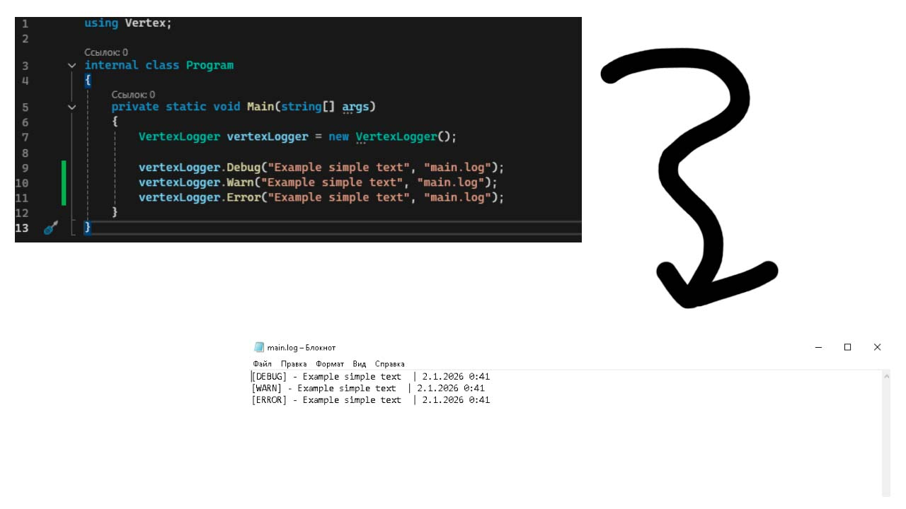

# VertexLogger
## VertexLogger - logger that allows you to log all actions in your project and automatically save them in a file

Example of using VertexLogger:

All methods:
1) DEBUG 
2) WARN
3) ERROR

